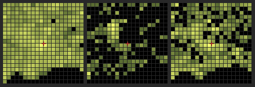

# GBIF Stufe 1 – Bestandsaufnahme der Pilzmeldungen

Erzeugt von `werkzeuge/gbif.js` am 2026-09-26. Nur Zählungen und Anteile, keine Fundorte. Quelle: GBIF.org (Occurrence Search API, abgerufen 2026-09-26).

**Filter:** country=DE, basisOfRecord=HUMAN_OBSERVATION, hasCoordinate=true, hasGeospatialIssue=false, Rechteck des Grundstocks 47.239–49.035 N, 10.230–12.921 E (München ±100 km, deutscher Teil), Jahre 2015–2026 (2026 unvollständig).

## Taxon-Schlüssel (species/match)

| Gruppe | GBIF-Name | Status | taxonKey |
|---|---:|---:|---:|
| Fichtensteinpilz (Ziel) | *Boletus edulis Bull.* | ACCEPTED | 5954958 |
| Pfifferling (Ziel) | *Cantharellus cibarius Fr.* | ACCEPTED | 5249504 |
| Sommersteinpilz (Ziel) | *Boletus reticulatus Schaeff.* | ACCEPTED | 5954691 |
| Marone (Zeiger) | *Imleria badia (Fr.) Vizzini* | ACCEPTED | 7832732 |
| Flockenstieliger Hexenröhrling (Zeiger) | *Neoboletus erythropus (Pers.) C.Hahn* | ACCEPTED | 9723190 |
| Flockenstieliger Hexenröhrling (Zeiger) | *Neoboletus luridiformis (Rostk.) Gelardi, Simonini & Vizzini* | ACCEPTED | 8208185 |
| Flockenstieliger Hexenröhrling (Zeiger) | *Boletus erythropus Krombh.* | ACCEPTED | 7601434 |
| Netzstieliger Hexenröhrling (Zeiger) | *Suillellus luridus (Schaeff.) Murrill* | ACCEPTED | 3355021 |
| Fliegenpilz (Zeiger) | *Amanita muscaria (L.) Lam.* | ACCEPTED | 8168319 |
| Pfefferröhrling (Zeiger) | *Chalciporus piperatus (Bull.) Bataille* | ACCEPTED | 9156243 |
| Semmelstoppelpilz (Zeiger) | *Hydnum repandum L.* | ACCEPTED | 2554716 |
| Hintergrund | *Fungi* | ACCEPTED | 5 |
| Flechten (abgezogen) | *Lecanoromycetes* (Klasse) | ACCEPTED | 180 |
| Flechten (abgezogen) | *Arthoniomycetes* (Klasse) | ACCEPTED | 313 |
| Flechten (abgezogen) | *Lichinomycetes* (Klasse) | ACCEPTED | 314 |
| Flechten (abgezogen) | *Coniocybomycetes* (Klasse) | ACCEPTED | 10874653 |
| Flechten (abgezogen) | *Candelariomycetes* (Klasse) | ACCEPTED | 10792796 |
| Flechten (abgezogen) | *Verrucariales* (Ordnung) | ACCEPTED | 1043 |

Die Suche über `taxonKey` schließt Synonyme ein (z. B. *Boletus aestivalis* → *B. reticulatus*, *Xerocomus badius* → *Imleria badia*). Beim Flockenstieligen Hexenröhrling führt GBIF drei Namen als eigene Arten; sie sind hier zusammengefasst. Flechten: abgezogen über die Klassen oben und die Ordnung Verrucariales; einzelne lichenisierte Gattungen in anderen Ordnungen bleiben im Hintergrund (geringer Anteil).

## a) Menge

### Meldungen je Art und Jahr

| Art | 2015 | 2016 | 2017 | 2018 | 2019 | 2020 | 2021 | 2022 | 2023 | 2024 | 2025 | 2026 | gesamt |
|---|---:|---:|---:|---:|---:|---:|---:|---:|---:|---:|---:|---:|---:|
| Fichtensteinpilz | 6 | 4 | 3 | 4 | 8 | 20 | 6 | 18 | 88 | 80 | 32 | 2 | **271** |
| Pfifferling | 8 | 2 | 2 | 1 | 4 | 7 | 2 | 3 | 5 | 12 | 9 | 1 | **56** |
| Sommersteinpilz | 2 | 0 | 0 | 0 | 0 | 2 | 0 | 1 | 6 | 1 | 1 | 1 | **14** |
| Marone | 2 | 3 | 7 | 3 | 13 | 32 | 13 | 40 | 19 | 26 | 69 | 0 | **227** |
| Flockenstieliger Hexenröhrling | 4 | 3 | 2 | 1 | 2 | 12 | 5 | 30 | 15 | 13 | 17 | 2 | **106** |
| Netzstieliger Hexenröhrling | 1 | 2 | 1 | 4 | 5 | 9 | 1 | 27 | 17 | 54 | 40 | 20 | **181** |
| Fliegenpilz | 5 | 6 | 18 | 17 | 27 | 93 | 38 | 138 | 109 | 218 | 226 | 1 | **896** |
| Pfefferröhrling | 0 | 0 | 1 | 0 | 2 | 3 | 1 | 1 | 1 | 0 | 9 | 0 | **18** |
| Semmelstoppelpilz | 0 | 4 | 1 | 1 | 1 | 3 | 3 | 4 | 2 | 2 | 4 | 0 | **25** |
| Hintergrund (Pilze ohne Flechten) | 343 | 485 | 625 | 253 | 726 | 1.857 | 1.239 | 2.814 | 2.431 | 4.137 | 6.082 | 1.856 | **22.848** |
| Flechten (abgezogen) | 22 | 42 | 54 | 119 | 108 | 173 | 154 | 293 | 321 | 4.006 | 3.410 | 941 | 9.643 |

Suchaufwand wächst: Hintergrund 2023–2025 = 8,7× so viele Meldungen wie 2015–2017. Anteile je Art an allen Pilzmeldungen (Ziel/Hintergrund) sind daher aussagekräftiger als absolute Zahlen.

Zum Vergleich Kinoko (modell/README.md, ganz Deutschland, alle Jahre): 746 827 Pilzmeldungen, davon 4 659 *B. edulis* (0,62 %) und 2 174 *C. cibarius* (0,29 %). Hier: Steinpilz 1,19 %, Pfifferling 0,25 % des Hintergrunds; das Gebiet hält 4,35 % der deutschen Pilzmeldungen (mit Flechten).

### Saisonkurve (Meldungen je Monat, alle Jahre)

| Art | Jan | Feb | Mär | Apr | Mai | Jun | Jul | Aug | Sep | Okt | Nov | Dez |
|---|---:|---:|---:|---:|---:|---:|---:|---:|---:|---:|---:|---:|
| Fichtensteinpilz | 1 | 0 | 0 | 0 | 0 | 4 | 7 | 103 | 82 | 71 | 2 | 1 |
| Pfifferling | 0 | 0 | 0 | 0 | 0 | 3 | 12 | 19 | 16 | 5 | 1 | 0 |
| Sommersteinpilz | 0 | 0 | 0 | 0 | 0 | 2 | 0 | 8 | 4 | 0 | 0 | 0 |
| Marone | 2 | 1 | 0 | 0 | 0 | 1 | 3 | 13 | 97 | 86 | 24 | 0 |
| Flockenstieliger Hexenröhrling | 1 | 0 | 0 | 0 | 2 | 7 | 11 | 27 | 36 | 20 | 2 | 0 |
| Netzstieliger Hexenröhrling | 0 | 0 | 0 | 0 | 2 | 30 | 53 | 47 | 47 | 1 | 1 | 0 |
| Fliegenpilz | 2 | 1 | 0 | 1 | 1 | 6 | 8 | 65 | 276 | 481 | 54 | 1 |
| Pfefferröhrling | 0 | 0 | 0 | 0 | 0 | 0 | 3 | 1 | 9 | 5 | 0 | 0 |
| Semmelstoppelpilz | 0 | 0 | 0 | 0 | 0 | 0 | 1 | 6 | 8 | 6 | 4 | 0 |
| Hintergrund | 928 | 1.050 | 1.261 | 1.295 | 1.231 | 1.196 | 1.289 | 2.248 | 4.583 | 5.332 | 1.457 | 978 |
| Steinpilz je 1000 Hintergrund | 1,1 | 0,0 | 0,0 | 0,0 | 0,0 | 3,3 | 5,4 | 45,8 | 17,9 | 13,3 | 1,4 | 1,0 |
| Pfifferling je 1000 Hintergrund | 0,0 | 0,0 | 0,0 | 0,0 | 0,0 | 2,5 | 9,3 | 8,5 | 3,5 | 0,9 | 0,7 | 0,0 |

## b) Qualität

| Art | Meldungen | mit Tagesdatum | Unsicherheit ≤ 150 m | Unsicherheit ≤ 500 m | Unsicherheit ≤ 1000 m | Unsicherheit größer | Unsicherheit unbekannt | Dubletten | Beobachter | größter Beobachter |
|---|---:|---:|---:|---:|---:|---:|---:|---:|---:|---:|
| Fichtensteinpilz | 271 | 100 % | 18 % | 10 % | 0 % | 63 % | 9 % | 5 | 83 | 54 % |
| Pfifferling | 56 | 100 % | 23 % | 27 % | 2 % | 30 % | 18 % | 1 | 33 | 18 % |
| Sommersteinpilz | 14 | 100 % | 29 % | 21 % | 7 % | 36 % | 7 % | 0 | 9 | 36 % |
| Marone | 227 | 100 % | 34 % | 15 % | 3 % | 19 % | 30 % | 22 | 107 | 9 % |
| Flockenstieliger Hexenröhrling | 106 | 100 % | 42 % | 18 % | 4 % | 14 % | 23 % | 1 | 66 | 10 % |
| Netzstieliger Hexenröhrling | 181 | 100 % | 54 % | 12 % | 2 % | 9 % | 23 % | 3 | 150 | 3 % |
| Fliegenpilz | 896 | 100 % | 52 % | 11 % | 2 % | 10 % | 25 % | 87 | 479 | 7 % |
| Pfefferröhrling | 18 | 100 % | 33 % | 11 % | 0 % | 17 % | 39 % | 0 | 15 | 17 % |
| Semmelstoppelpilz | 25 | 100 % | 28 % | 44 % | 4 % | 16 % | 8 % | 0 | 21 | 12 % |
| Hintergrund | 22.848 | 100,0 % | 50,5 % | 18,8 % | 2,1 % | 7,0 % | 21,7 % | 1.746 | 2.893 | 11,7 % |

Dublette = gleicher Beobachter (Hash), gleicher Tag, gleiche Art, weniger als 200 m entfernt (ohne die erste).

**Verschleierte Fundorte:** Fast alle Meldungen mit Unsicherheit > 1 km stammen von iNaturalist und sind auf ≈ 27 km vergröbert („Coordinate uncertainty increased … at the request of the observer“). Betroffen: Steinpilz 60 %, Pfifferling 25 %, Marone 15 %, Hintergrund 4,4 %. Beim Steinpilz kommen 145 der 163 verschleierten Meldungen von einem einzigen Beobachter (v. a. 2023/24) – der Sprung in der Jahresreihe ist also ein Einzelner, kein Pilzjahr. Für Ort-genaue Auswertungen bleiben beim Steinpilz 101 Meldungen.

### Datensätze und Lizenzen (Hintergrund)

| Datensatz | Lizenz (Datensatz) | Meldungen | Anteil | davon Zielarten |
|---|---:|---:|---:|---:|
| iNaturalist Research-grade Observations | CC BY-NC | 13.268 | 58,1 % | 254 |
| Observation.org, Nature data from around the World | CC BY-NC | 5.544 | 24,3 % | 38 |
| NABU|naturgucker | CC BY | 3.980 | 17,4 % | 49 |
| Mushroom Observer | CC BY-NC | 17 | 0,1 % | 0 |
| ArtenFinder | CC0 | 17 | 0,1 % | 0 |
| Fungus Collections at Staatliches Museum für Naturkunde Karlsruhe (Herbarium KR) | CC BY | 14 | 0,1 % | 0 |
| Swiss National Fungi Databank | CC BY | 3 | 0,0 % | 0 |
| Earth Guardians Weekly Feed | CC BY-NC | 3 | 0,0 % | 0 |
| Danish Mycological Society, fungal records database | CC BY-NC | 1 | 0,0 % | 0 |
| Biodiversity4all Research-Grade Observations | CC BY-NC | 1 | 0,0 % | 0 |

Lizenz je Meldung – Hintergrund: CC BY-NC 70,0 %, CC BY 29,2 %, CC0 0,8 %; Zielarten: CC BY 64 %, CC BY-NC 35 %, CC0 1 %.

## c) Raum

| Art | Meldungen | im Wald (Grundstock, 150 m) | im Wald, Unsicherheit ≤ 500 m |
|---|---:|---:|---:|
| Fichtensteinpilz | 271 | 47 % | 72 % |
| Pfifferling | 56 | 54 % | 50 % |
| Sommersteinpilz | 14 | 50 % | 57 % |
| Marone | 227 | 75 % | 84 % |
| Flockenstieliger Hexenröhrling | 106 | 69 % | 70 % |
| Netzstieliger Hexenröhrling | 181 | 52 % | 58 % |
| Fliegenpilz | 896 | 74 % | 79 % |
| Pfefferröhrling | 18 | 72 % | 100 % |
| Semmelstoppelpilz | 25 | 80 % | 89 % |
| Hintergrund | 22.848 | 61,2 % | 62,6 % |

Waldmaske = Baumartenkarte (Thünen) im 150-m-Raster; Meldungen am Waldrand oder mit grober Koordinate fallen oft knapp daneben – der Anteil ist eher eine Untergrenze.

|  | belegte 10-km-Zellen (von 400) | Anteil der Meldungen in den 10 % stärksten Zellen |
|---|---:|---:|
| Hintergrund | 347 | 48,3 % |
| Zielarten | 121 | 48 % |
| Zeiger | 260 | 36,9 % |

Stadtnähe: 21,5 % des Hintergrunds und 3 % der Zielarten liegen im 15-km-Kreis um die Münchner Innenstadt (1,8 % der Rechteckfläche).

Bild: Meldungen je 10-km-Zelle, links Hintergrund, Mitte Zielarten (Steinpilz, Pfifferling, Sommersteinpilz), rechts Zeiger; Norden oben, logarithmisch von dunkel (1) bis hell (Höchstwert), schwarz = keine Meldung, rotes Kreuz = Stadtmitte München. Verschleierte Meldungen (siehe b) liegen irgendwo in ihrer ≈ 0,2°-Zelle.

## d) Standort an der Meldestelle (Unsicherheit ≤ 500 m, im Wald)

Anteil je Klasse; in Klammern das Verhältnis zum Hintergrund (> 1 = häufiger als bei allen Pilzmeldungen im Wald). n = Meldungen mit Unsicherheit ≤ 500 m im Wald. Arten mit weniger als 5 solchen Meldungen fehlen.

### Baumart

| Baumart | Hintergrund (n = 9.904) | Fichtensteinpilz (n = 55) | Pfifferling (n = 14) | Marone (n = 92) | Flockenstieliger Hexenröhrling (n = 44) | Netzstieliger Hexenröhrling (n = 68) | Fliegenpilz (n = 448) | Pfefferröhrling (n = 8) | Semmelstoppelpilz (n = 16) |
|---|---:|---:|---:|---:|---:|---:|---:|---:|---:|
| Fichte | 64 % | 75 % (1,2) | 86 % (1,3) | 77 % (1,2) | 84 % (1,3) | 65 % (1,0) | 87 % (1,4) | 75 % (1,2) | 69 % (1,1) |
| Kiefer | 1 % | 0 % (0,0) | 0 % (0,0) | 2 % (2,9) | 5 % (6,2) | 0 % (0,0) | 3 % (4,5) | 0 % (0,0) | 0 % (0,0) |
| Douglasie | 1 % | 0 % (0,0) | 0 % (0,0) | 0 % (0,0) | 2 % (3,8) | 0 % (0,0) | 2 % (4,1) | 0 % (0,0) | 0 % (0,0) |
| Tanne | 0 % | 0 % (0,0) | 0 % (0,0) | 0 % (0,0) | 0 % (0,0) | 0 % (0,0) | 0 % (0,0) | 0 % (0,0) | 0 % (0,0) |
| Lärche | 0 % | 0 % (0,0) | 0 % (0,0) | 0 % (0,0) | 0 % (0,0) | 0 % (0,0) | 0 % (0,6) | 0 % (0,0) | 0 % (0,0) |
| Buche | 25 % | 18 % (0,7) | 14 % (0,6) | 14 % (0,6) | 7 % (0,3) | 31 % (1,2) | 4 % (0,2) | 25 % (1,0) | 31 % (1,2) |
| Eiche | 3 % | 4 % (1,1) | 0 % (0,0) | 2 % (0,7) | 0 % (0,0) | 1 % (0,4) | 1 % (0,3) | 0 % (0,0) | 0 % (0,0) |
| Erle | 1 % | 2 % (2,3) | 0 % (0,0) | 1 % (1,4) | 0 % (0,0) | 0 % (0,0) | 0 % (0,3) | 0 % (0,0) | 0 % (0,0) |
| Birke | 1 % | 0 % (0,0) | 0 % (0,0) | 1 % (1,8) | 0 % (0,0) | 0 % (0,0) | 0 % (0,4) | 0 % (0,0) | 0 % (0,0) |
| sonst. Laub, langlebig | 4 % | 2 % (0,4) | 0 % (0,0) | 2 % (0,5) | 2 % (0,5) | 3 % (0,7) | 1 % (0,3) | 0 % (0,0) | 0 % (0,0) |
| sonst. Laub, kurzlebig | 0 % | 0 % (0,0) | 0 % (0,0) | 0 % (0,0) | 0 % (0,0) | 0 % (0,0) | 0 % (0,0) | 0 % (0,0) | 0 % (0,0) |

### Boden

| Boden | Hintergrund (n = 9.904) | Fichtensteinpilz (n = 55) | Pfifferling (n = 14) | Marone (n = 92) | Flockenstieliger Hexenröhrling (n = 44) | Netzstieliger Hexenröhrling (n = 68) | Fliegenpilz (n = 448) | Pfefferröhrling (n = 8) | Semmelstoppelpilz (n = 16) |
|---|---:|---:|---:|---:|---:|---:|---:|---:|---:|
| sauer | 58 % | 62 % (1,1) | 79 % (1,4) | 67 % (1,2) | 68 % (1,2) | 41 % (0,7) | 68 % (1,2) | 75 % (1,3) | 50 % (0,9) |
| neutral | 8 % | 15 % (1,8) | 7 % (0,9) | 16 % (2,1) | 11 % (1,4) | 6 % (0,7) | 13 % (1,7) | 13 % (1,6) | 6 % (0,8) |
| kalk | 18 % | 11 % (0,6) | 14 % (0,8) | 7 % (0,4) | 9 % (0,5) | 37 % (2,0) | 10 % (0,6) | 0 % (0,0) | 19 % (1,0) |
| moor | 11 % | 7 % (0,7) | 0 % (0,0) | 8 % (0,7) | 9 % (0,8) | 12 % (1,1) | 6 % (0,5) | 0 % (0,0) | 0 % (0,0) |
| unbekannt | 5 % | 5 % (1,0) | 0 % (0,0) | 2 % (0,4) | 2 % (0,4) | 4 % (0,8) | 2 % (0,5) | 13 % (2,3) | 25 % (4,6) |

### Lage

| Lage | Hintergrund (n = 9.904) | Fichtensteinpilz (n = 55) | Pfifferling (n = 14) | Marone (n = 92) | Flockenstieliger Hexenröhrling (n = 44) | Netzstieliger Hexenröhrling (n = 68) | Fliegenpilz (n = 448) | Pfefferröhrling (n = 8) | Semmelstoppelpilz (n = 16) |
|---|---:|---:|---:|---:|---:|---:|---:|---:|---:|
| eben | 19 % | 7 % (0,4) | 7 % (0,4) | 16 % (0,9) | 18 % (1,0) | 7 % (0,4) | 12 % (0,6) | 13 % (0,7) | 0 % (0,0) |
| nord | 30 % | 33 % (1,1) | 29 % (0,9) | 23 % (0,8) | 25 % (0,8) | 43 % (1,4) | 32 % (1,1) | 50 % (1,7) | 44 % (1,4) |
| sued | 15 % | 18 % (1,2) | 14 % (0,9) | 20 % (1,3) | 11 % (0,7) | 24 % (1,5) | 17 % (1,1) | 0 % (0,0) | 19 % (1,2) |
| ost | 17 % | 18 % (1,1) | 29 % (1,7) | 15 % (0,9) | 18 % (1,1) | 15 % (0,9) | 19 % (1,2) | 0 % (0,0) | 19 % (1,1) |
| west | 19 % | 24 % (1,2) | 21 % (1,1) | 26 % (1,4) | 27 % (1,4) | 12 % (0,6) | 20 % (1,0) | 38 % (2,0) | 19 % (1,0) |

### Höhe

| Höhe | Hintergrund (n = 9.904) | Fichtensteinpilz (n = 55) | Pfifferling (n = 14) | Marone (n = 92) | Flockenstieliger Hexenröhrling (n = 44) | Netzstieliger Hexenröhrling (n = 68) | Fliegenpilz (n = 448) | Pfefferröhrling (n = 8) | Semmelstoppelpilz (n = 16) |
|---|---:|---:|---:|---:|---:|---:|---:|---:|---:|
| < 500 m | 22 % | 15 % (0,7) | 14 % (0,7) | 26 % (1,2) | 16 % (0,7) | 6 % (0,3) | 20 % (0,9) | 25 % (1,1) | 13 % (0,6) |
| 500–700 m | 61 % | 56 % (0,9) | 36 % (0,6) | 67 % (1,1) | 50 % (0,8) | 26 % (0,4) | 53 % (0,9) | 50 % (0,8) | 56 % (0,9) |
| 700–900 m | 9 % | 7 % (0,8) | 29 % (3,3) | 7 % (0,8) | 20 % (2,4) | 29 % (3,4) | 10 % (1,1) | 25 % (2,9) | 13 % (1,4) |
| 900–1200 m | 7 % | 16 % (2,4) | 7 % (1,1) | 0 % (0,0) | 7 % (1,0) | 29 % (4,4) | 9 % (1,4) | 0 % (0,0) | 19 % (2,8) |
| ≥ 1200 m | 2 % | 5 % (3,1) | 14 % (8,1) | 0 % (0,0) | 7 % (3,9) | 9 % (5,0) | 7 % (4,2) | 0 % (0,0) | 0 % (0,0) |

Nur beschrieben, nichts ins Modell übernommen.

## e) Tauglichkeit für Stufe 2

Zelle-Wochen = verschiedene Kombinationen aus Rasterzelle und Kalenderwoche mit mindestens einer Meldung (nur Tagesdatum, Juni–November, Unsicherheit ≤ halbe Zellgröße oder unbekannt – verschleierte Meldungen fallen weg). Hintergrund: 7.802 Zelle-Wochen bei 1 km, 6.653 bei 5 km.

| Art / Gruppe | Zelle-Wochen 1 km | Anteil am Hintergrund 1 km | Zelle-Wochen 5 km | Anteil am Hintergrund 5 km |
|---|---:|---:|---:|---:|
| Fichtensteinpilz | 95 | 1,2 % | 95 | 1,4 % |
| Pfifferling | 37 | 0,5 % | 37 | 0,6 % |
| Sommersteinpilz | 8 | 0,1 % | 8 | 0,1 % |
| Steinpilz + Sommersteinpilz | 100 | 1,3 % | 101 | 1,5 % |
| alle Zielarten | 129 | 1,7 % | 132 | 2,0 % |
| Zielarten + Zeiger | 1.110 | 14,2 % | 1.087 | 16,3 % |

### Wetter-Archiv für 2015–2025

| Weg | Orte | Abrufe (Open-Meteo-Zählregel) | Tage bei 10 000/Tag |
|---|---:|---:|---:|
| Open-Meteo-Archiv, 0,1°-Zellen mit Meldungen, Saison (Mai–Nov + 35 Tage) | 440 | 86.240 | 8,6 |
| Open-Meteo-Archiv, 5-km-Zellen mit Meldungen, Saison | 1.127 | 220.892 | 22,1 |
| Open-Meteo-Archiv, 5-km-Zellen, ganzjährig | 1.127 | 323.449 | 32,3 |

Gerechnet mit 4 Variablen (Regen, ET0, Tmin, Tmax) je Ort und Anfrage, Abrufe = Orte × Tage/14 (wie `omZaehlen`). Das Archiv (ERA5/ERA5-Land ≈ 9–11 km) ist gröber als 5 km – mehrere 5-km-Zellen teilen sich einen Modellpunkt, 0,1° genügt also. DWD HYRAS (opendata.dwd.de, `grids_germany/daily/hyras_de`, 1 km, Regen und Temperatur tägl.): je Jahr und Variable eine NetCDF-Datei (Regen ≈ 45 MB, Temperatur ≈ 70 MB), für 11 Jahre × 4 Variablen ≈ 44 Downloads, ≈ 2,8 GB, ohne Abrufgrenze; Regen dort aus Stationen interpoliert wie der Pin (aber ohne ET0 → aus Temperatur schätzen).

## f) Grenzen

- **Suchaufwand:** Wochenende 40,4 % des Hintergrunds und 32 % der Zielarten (bei Gleichverteilung 29 %); Stadtnähe und Häufung in wenigen Zellen siehe c). Meldungen zeigen, wo und wann gesucht wurde – ohne Hintergrund taugen sie nicht als Fundwahrscheinlichkeit.
- **Fehlbestimmungen:** Steinpilz und Sommersteinpilz werden oft verwechselt (der eigene Fund vom 25.9. ist ein Beispiel); iNaturalist „Research grade“ braucht nur zwei übereinstimmende Bestimmungen, andere Plattformen prüfen unterschiedlich. *Boletus pinophilus* (Kiefern-Steinpilz) ist nicht enthalten.
- **Sommersteinpilz:** 14 Meldungen in 12 Jahren – für eine eigene Auswertung zu wenig.
- **Leerstellen:** Keine Meldung heißt nicht „kein Pilz“; Stufe 2 kann nur relativ zum Hintergrund werten (Anteil der Zielart an allen Pilzmeldungen derselben Zelle und Woche).
- **Koordinaten:** „unbekannte“ Unsicherheit ist meist eine Punktangabe ohne Genauigkeit; grobe Rundung (COORDINATE_ROUNDED) versetzt Meldungen um bis zu einige 100 m.

## Aufwand

Einzelmeldungen: 210 Seiten à 300 (Ziel-, Zeigerarten und Hintergrund, je Jahr), höchstens 1 Abruf/s → etwa 4 min beim ersten Lauf, danach aus dem Zwischenspeicher. Zählungen: 11 Abrufe, Taxa 18, Datensätze 10.
